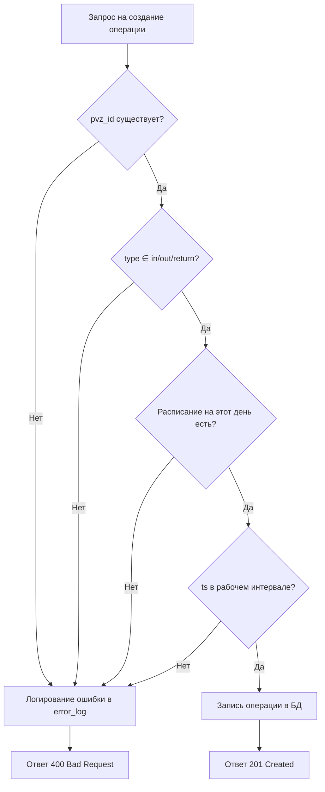

# DOC-REQ-001 — User Stories

| Версия | Статус | Дата создания | Дата обновления |
|--------|--------|---------------|-----------------|
| v1.1   | Draft  | 2026-05-01    | 2026-05-19      |

О документе: требования в формате пользовательских историй с критериями приёмки.

Для кого: команда проекта, заказчик, тестировщик.

Основано на: [персонах](../01-discovery/personas.md), [кейсе проекта](../../SRS.md).

---

## Авторы документа

- Рахимов Руслан Саидович — Team Lead — формализация и приоритизация
- Безручко Александр Вадимович — Backend — оценка реализуемости

## История изменений

- [v1.0] [2026-05-01] (Рахимов): первичные user stories по 3 ролям.
- [v1.1] [2026-05-10] (Рахимов, Безручко): добавлены критерии приёмки.

---

## Роли в системе

| Роль                  | Описание                                                                                         |
|-----------------------|--------------------------------------------------------------------------------------------------|
| Оператор ПВЗ          | Сотрудник конкретного пункта выдачи. Регистрирует операции, следит за загрузкой своей точки.    |
| Супервайзер региона   | Менеджер группы ПВЗ. Контролирует показатели и распределение нагрузки по региону.               |
| Операционный аналитик | Специалист по данным. Анализирует всю сеть, выгружает отчёты, отслеживает ошибки валидации.    |

---

## Оператор ПВЗ

| ID    | User Story                                                                                                                      | Приоритет | Критерии приёмки                                                                        |
|-------|---------------------------------------------------------------------------------------------------------------------------------|-----------|-----------------------------------------------------------------------------------------|
| US-01 | Как оператор, я хочу авторизоваться в системе, чтобы получить доступ только к данным своей точки.                             | Must      | Вход по логину/паролю; после входа доступны только данные своего `pvz_id`.              |
| US-02 | Как оператор, я хочу видеть информацию о своём ПВЗ и его расписание, чтобы знать режим работы.                                | Must      | Отображаются адрес, `capacity_per_hour`, расписание по дням недели.                     |
| US-03 | Как оператор, я хочу регистрировать операции `in`, `out`, `return`, чтобы фиксировать товарооборот.                           | Must      | Операция сохраняется в БД; при нарушении расписания — ошибка с пояснением.              |
| US-04 | Как оператор, я хочу видеть список последних операций своей точки, чтобы контролировать корректность ввода.                   | Must      | Список 20 последних операций с типом, временем и статусом валидации.                    |
| US-05 | Как оператор, я хочу видеть текущую загрузку точки (load %) в режиме текущего часа, чтобы понимать, не близок ли предел.      | Should    | Виджет с текущим `ops_per_hour`, `capacity_per_hour` и `load %` обновляется при запросе.|
| US-06 | Как оператор, я хочу видеть тепловую карту загрузки своей точки по дням/часам, чтобы знать пиковые интервалы.                | Could     | Тепловая карта с цветовой шкалой: зелёный / жёлтый / красный / тёмно-красный.          |

---

## Супервайзер региона

| ID    | User Story                                                                                                                        | Приоритет | Критерии приёмки                                                                             |
|-------|-----------------------------------------------------------------------------------------------------------------------------------|-----------|----------------------------------------------------------------------------------------------|
| US-07 | Как супервайзер, я хочу видеть список всех ПВЗ в моём регионе, чтобы иметь быстрый доступ к их данным.                          | Must      | Список ПВЗ с адресом, `capacity_per_hour` и текущим статусом загрузки.                       |
| US-08 | Как супервайзер, я хочу фильтровать историю операций по дате и типу, чтобы отслеживать активность точек.                         | Must      | Фильтры по `date_from`/`date_to`, `pvz_id`, `type`; результат отображается в таблице.        |
| US-09 | Как супервайзер, я хочу видеть сводный отчёт загрузки с индикацией перегруженных точек, чтобы оперативно реагировать.            | Must      | В отчёте: `pvz_id`, `hour`, `ops`, `capacity`, `load %`, флаг `overload`; красная подсветка. |
| US-10 | Как супервайзер, я хочу просматривать тепловую карту для любого ПВЗ региона, чтобы анализировать паттерны нагрузки.              | Should    | Тепловая карта доступна для каждого ПВЗ с выбором периода.                                   |
| US-11 | Как супервайзер, я хочу просматривать лог ошибок валидации, чтобы выявлять нарушения регламента (операции вне рабочих часов).    | Should    | Лог с полями: `pvz_id`, `ts`, `type`, `reason`; фильтрация по дате и точке.                 |

---

## Операционный аналитик

| ID    | User Story                                                                                                                              | Приоритет | Критерии приёмки                                                                            |
|-------|-----------------------------------------------------------------------------------------------------------------------------------------|-----------|---------------------------------------------------------------------------------------------|
| US-12 | Как аналитик, я хочу иметь доступ к данным всех ПВЗ без региональных ограничений, чтобы проводить полный аудит.                       | Must      | Аналитику доступны все ПВЗ, все операции и все отчёты в системе.                            |
| US-13 | Как аналитик, я хочу видеть KPI (средняя загрузка, доля перегруженных интервалов) в отчётах, чтобы оценивать эффективность сети.      | Must      | KPI-панель: средняя загрузка в часы пик, % интервалов с load > 100%.                        |
| US-14 | Как аналитик, я хочу экспортировать данные о загрузке в CSV, чтобы проводить анализ в сторонних инструментах.                         | Must      | CSV содержит поля: `pvz_id`, `date`, `hour`, `ops`, `capacity`, `load`; кодировка UTF-8.    |
| US-15 | Как аналитик, я хочу создавать операции вручную для любого ПВЗ, чтобы корректировать статистику при массовой загрузке.                | Could     | POST /api/operations принимает `pvz_id`, `ts`, `type`; валидация применяется в полной мере. |

---

## Диаграмма процесса регистрации операции

**Правила переходов:**
1. `pvz_id` должен существовать в таблице `pvz`.
2. `type` должен быть одним из: `in`, `out`, `return`.
3. Для ПВЗ должно быть задано расписание на день недели операции.
4. Время `ts` должно попадать в интервал `[open_time, close_time]` из расписания.
5. Все отклонённые операции записываются в `error_log` с указанием причины.
