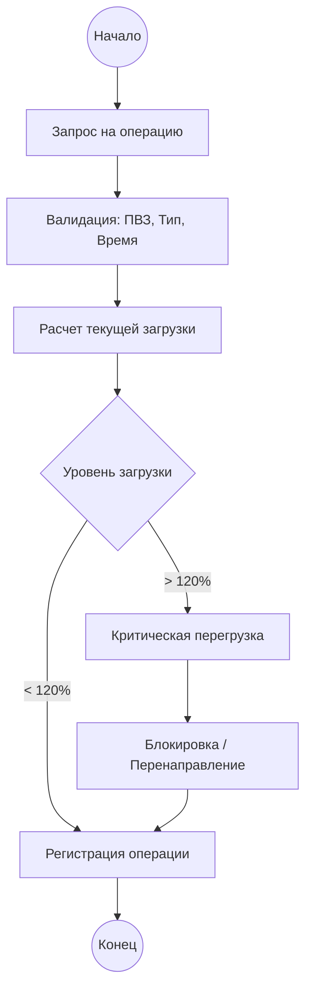

# BPMN-диаграмма (текстовое описание)

## Участники процесса
- Оператор ПВЗ
- Супервайзер региона
- Операционный аналитик

## Последовательность шагов
1. **Инициирование операции:** Оператор или внешняя система (1С) отправляет запрос на регистрацию действия (прием, выдача, возврат).
2. **Валидация контекста:** Система проверяет, открыт ли ПВЗ в данный момент согласно расписанию.
3. **Расчет текущей загрузки:** Система вычисляет количество операций за текущий час и сопоставляет с паспортной мощностью ПВЗ.
4. **Классификация состояния:**
    - Если загрузка < 85% — состояние «Норма».
    - Если 85-100% — состояние «Предупреждение».
    - Если 100-120% — состояние «Перегрузка».
    - Если > 120% — состояние «Критическая перегрузка».
5. **Регистрация и реакция:** Операция записывается в БД. При критической перегрузке инициируется процесс оповещения или временной блокировки приема новых отправлений.

## Альтернативные потоки
- Если пропускная способность превышена, операция регистрируется, но помечается как перегрузка в отчетах.

## Альтернативные сценарии
- Отмена операции при критической перегрузке
- Перенаправление операций на соседний ПВЗ
- Автоматическая блокировка новых операций при перегрузке >120%