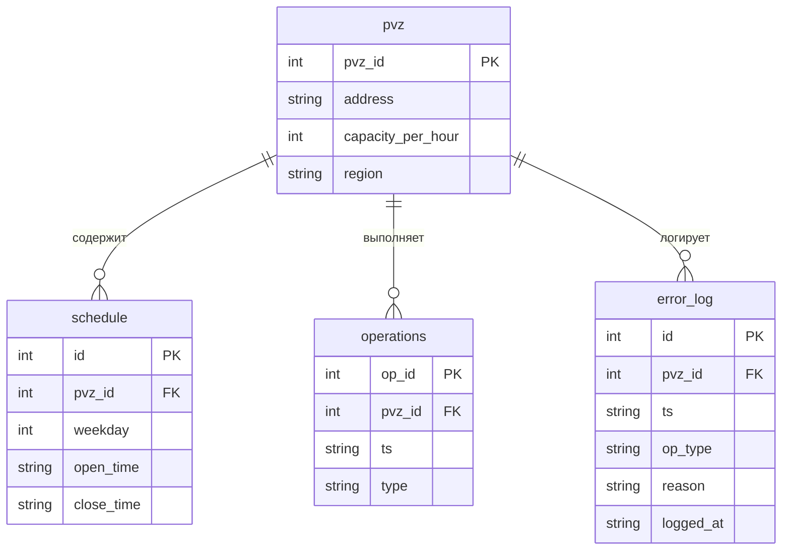

# ER-диаграмма (модель данных)

## Сущности и атрибуты
- **pvz** (pvz_id, address, capacity_per_hour, region)
- **schedule** (id, pvz_id, weekday, open_time, close_time)
- **operations** (op_id, pvz_id, ts, type)
- **error_log** (id, pvz_id, ts, op_type, reason, logged_at)

## Связи
- 1:N между pvz и schedule по полю pvz_id.
- 1:N между pvz и operations по полю pvz_id.
- 1:N между pvz и error_log по полю pvz_id (логическая связь).

## Mermaid-схема

