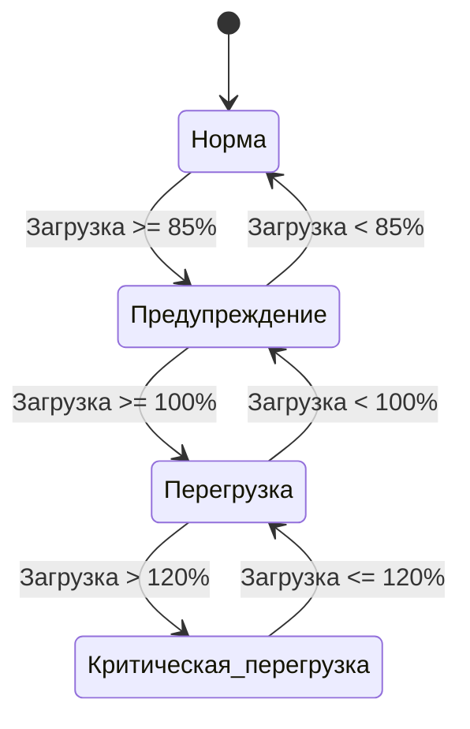

# Диаграмма состояний (если применимо)

Для ПВЗ определены состояния в зависимости от уровня текущей загрузки:

| Состояние | Порог загрузки | Описание |
|-----------|----------------|----------|
| **Норма** | < 85% | ПВЗ работает в штатном режиме. |
| **Предупреждение** | 85% – 100% | Нагрузка близка к предельной, возможны очереди. |
| **Перегрузка** | 100% – 120% | Превышение паспортной мощности, требуется внимание супервайзера. |
| **Критическая перегрузка** | > 120% | Работа ПВЗ затруднена, необходимы экстренные меры. |

