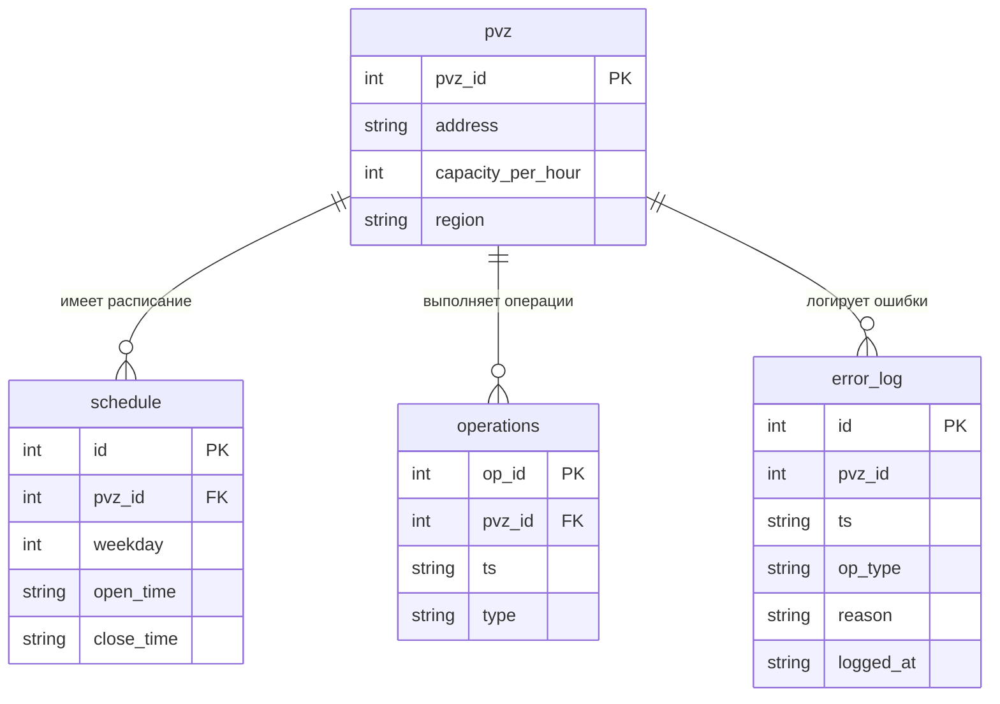

# DOC-DAT-001 — Логическая модель данных и ERD

| Версия | Статус | Дата создания | Дата обновления |
|--------|--------|---------------|-----------------|
| v1.1   | Draft  | 2026-05-05    | 2026-05-19      |

О документе: логическая модель данных системы PVZ Monitor — сущности, атрибуты и связи.

Для кого: backend-разработчики, аналитик, тестировщик.

Основано на: [кейсе проекта](../../SRS.md), [user stories](../02-requirements/user_stories.md).

---

## Авторы документа

- Безручко Александр Вадимович — Backend Developer — проектирование модели
- Юркив Альберт Александрович — Backend Developer — агрегации и отчёты

## История изменений

- [v1.0] [2026-05-05] (Безручко): первичная ER-диаграмма.
- [v1.1] [2026-05-10] (Безручко, Юркив): добавлена таблица `error_log`, уточнены связи.

---

## ER-диаграмма

---

## Описание сущностей

### `pvz` — Пункт выдачи заказов

| Поле               | Тип     | Ограничения        | Описание                                    |
|--------------------|---------|--------------------|---------------------------------------------|
| `pvz_id`           | INTEGER | PK                 | Уникальный идентификатор ПВЗ                |
| `address`          | TEXT    | NOT NULL           | Адрес точки                                 |
| `capacity_per_hour`| INTEGER | NOT NULL, > 0      | Паспортная пропускная способность (ops/час) |
| `region`           | TEXT    | NOT NULL           | Регион для группировки в отчётах            |

### `schedule` — Расписание работы ПВЗ

| Поле        | Тип     | Ограничения              | Описание                                    |
|-------------|---------|--------------------------|---------------------------------------------|
| `id`        | INTEGER | PK                       | Идентификатор записи расписания             |
| `pvz_id`    | INTEGER | FK → pvz.pvz_id, NOT NULL| Ссылка на ПВЗ                               |
| `weekday`   | INTEGER | NOT NULL, ∈ {0..6}       | День недели (0 = пн, 6 = вс)               |
| `open_time` | TEXT    | NOT NULL, формат HH:MM   | Время открытия                              |
| `close_time`| TEXT    | NOT NULL, формат HH:MM   | Время закрытия; close_time > open_time      |

### `operations` — Операции

| Поле     | Тип     | Ограничения                   | Описание                              |
|----------|---------|-------------------------------|---------------------------------------|
| `op_id`  | INTEGER | PK                            | Идентификатор операции                |
| `pvz_id` | INTEGER | FK → pvz.pvz_id, NOT NULL     | Ссылка на ПВЗ                         |
| `ts`     | TEXT    | NOT NULL, ISO 8601            | Метка времени операции                |
| `type`   | TEXT    | NOT NULL, ∈ {in, out, return} | Тип операции                          |

### `error_log` — Лог ошибок валидации

| Поле       | Тип     | Ограничения | Описание                                         |
|------------|---------|-------------|--------------------------------------------------|
| `id`       | INTEGER | PK          | Идентификатор записи лога                        |
| `pvz_id`   | INTEGER | NOT NULL    | ПВЗ, для которого была попытка операции          |
| `ts`       | TEXT    | NOT NULL    | Время попытки операции                           |
| `op_type`  | TEXT    | NOT NULL    | Тип операции, который пытались создать           |
| `reason`   | TEXT    | NOT NULL    | Причина отказа                                   |
| `logged_at`| TEXT    | NOT NULL    | Время записи в лог                               |

---

## Ключевые связи

| Связь                | Тип | Описание                                            |
|----------------------|-----|-----------------------------------------------------|
| `pvz` → `schedule`   | 1:N | У одного ПВЗ несколько записей расписания по дням   |
| `pvz` → `operations` | 1:N | Один ПВЗ выполняет множество операций               |
| `pvz` → `error_log`  | 1:N | Один ПВЗ может иметь несколько записей в логе ошибок|
